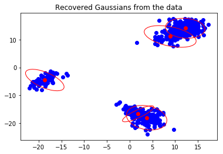

# Inference in Gaussian Mixture Models and the EM Algorithm

This script shows how the Expectation-Maximaisation (EM) Algorithm can be used to recover the means and covariance matrices from data which is assumed to be generated by a Gaussian-mixture model.

## Core Problem From a Learning Perspective

The core of problem is that we observe data points $x_i$, but we are not given from which Gaussian they came from. We assume that the data arose from a Gaussian-mixture model, and by using the EM Algorithm, we are able to give predictions for the means of the Gaussians, the mixing coefficients, and the covariance matrices. Thus, the only parameter that we set is the number of Gaussians $k$ which is why the EM algorithm is an example of unsupervised learning. We could extend our model to its hierarchical version to infer $k$ itself from the data. However, this is not part of this script.

For more detailed explanations, please have a look at the jupyter notebook!
